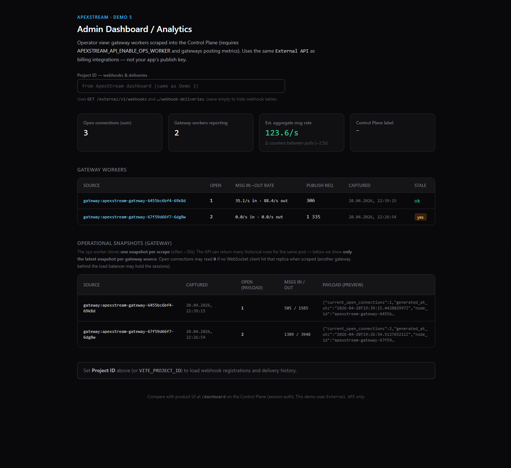
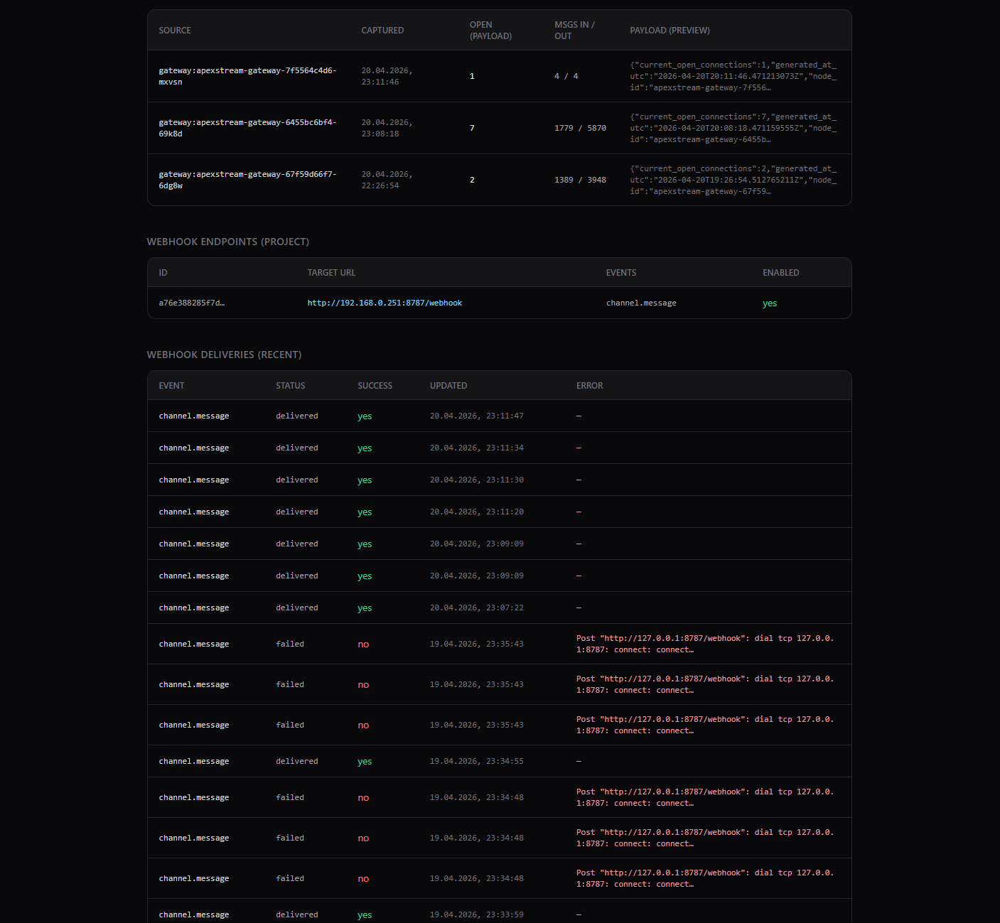

# ApexStream DEMO 5 — Admin Dashboard / Analytics

**Operator / platform** demo — *how do we observe ApexStream itself?* Not the same as [Demo 2 (Live Dashboard)](../dashboard/README.md), which shows **B2B product KPIs** over WebSockets.

See also: [Examples index](../README.md).

## Screenshots





## Client source

External API polling and rates live in **`client/src/useAdminDashboard.ts`**. Shared types + table formatting helpers: **`adminDashboardModel.ts`**. HTTP base + proxy: **`externalApi.ts`**. **`App.tsx`** is presentation only.

---

## Why

Prospects want proof they can **operate** the stack: connections, throughput, and health signals — not a black box.

---

## What this client shows

| Source | Content |
|--------|---------|
| `GET /external/v1/metrics/gateway-workers` | Per-gateway-worker rows (open connections, cumulative message counters, publish requests, stale flag). |
| `GET /external/v1/metrics/operational?service=gateway` | Recent operational metric snapshots stored by the Control Plane. |

The UI **polls** every few seconds and estimates **message rates** from consecutive samples (counter deltas / time). Requires **`APEXSTREAM_EXTERNAL_API_KEY`** on the API (same value as `VITE_EXTERNAL_API_KEY` here).

**Backend:** gateways must expose **`/internal/v1/metrics`** and the Control Plane **ops worker** must scrape them (`APEXSTREAM_API_ENABLE_OPS_WORKER=true` in HA-style deployments). If workers are empty, see `AGENTS.md` and `docs/runbook-env-install-run-scale.md`.

---

## Configure

From **`examples/admin-analytics`**:

```bash
cp client/.env.example client/.env
```

Edit **`client/.env`**:

- **`VITE_CONTROL_PLANE_URL`** — Control Plane HTTP base (e.g. `http://localhost:8080` or LAN IP).
- **`VITE_EXTERNAL_API_KEY`** — must match **`APEXSTREAM_EXTERNAL_API_KEY`** on the API.
- **`VITE_PROJECT_ID`** (optional) — Mongo project id from the dashboard; enables **webhook configs** and **webhook deliveries** tables (`GET /external/v1/webhooks`, `…/webhook-deliveries`). You can also type the id in the UI without restarting.

Optional: **`VITE_POLL_INTERVAL_MS`** (default `2500`). For LAN, set **`VITE_CONTROL_PLANE_PROXY_TARGET`** if the proxy target differs from `VITE_CONTROL_PLANE_URL`.

---

## Run locally (npm)

From the demo folder (after `npm install` in `client/` once):

```bash
cd examples/admin-analytics
npm run dev
```

Or from **`client/`** only:

```bash
cd examples/admin-analytics/client
npm install
npm run dev
```

Open **http://localhost:5177**.

---

## Run with Docker Compose (optional)

See [`docker-compose.yml`](./docker-compose.yml). Mounts **`./client`** only (`npm ci`). Copy **`client/.env`** first. If the API runs on the host, set **`VITE_CONTROL_PLANE_PROXY_TARGET=http://host.docker.internal:8080`** in **`client/.env`** for the **`/apex-api`** proxy.

```bash
cd examples/admin-analytics
docker compose up
```

---

## Who it sells to

- **Operational control** — platform / SRE-adjacent buyers.
- **Enterprise** — buyers who expect **visibility** alongside SLAs.

---

## Pitch (one paragraph)

An **Admin Dashboard / Analytics** view shows ApexStream is **operable**: live gateway and operational signals through the **External API** — aligned with how partners integrate billing and automation, without using your app’s publish keys.
