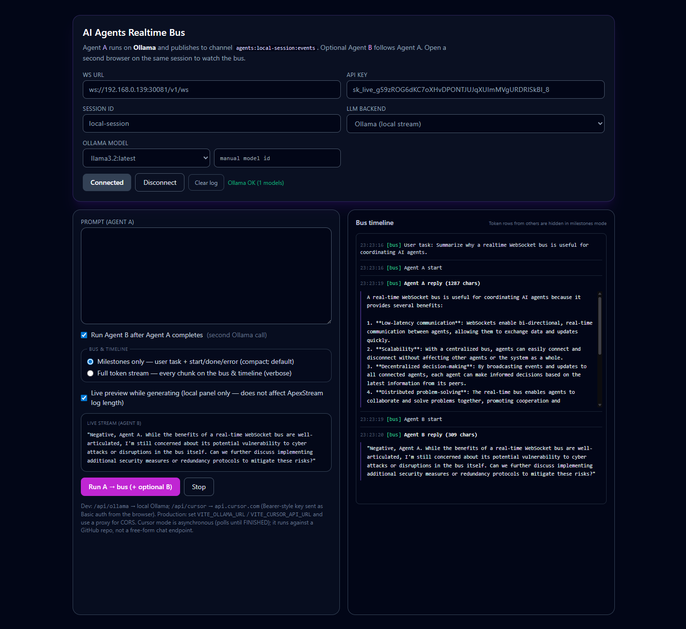

# ApexStream DEMO 6 — AI Agents Realtime Bus

Runnable **`client/`** (Vite, port **5178**) — streams **Ollama** locally or runs **[Cursor Cloud Agents API](https://cursor.com/docs/cloud-agent/api/endpoints)** jobs, publishing results onto an ApexStream channel so other browsers on the same session see the **agent event bus** live.

See [Examples index](../README.md).

## Screenshot



## Client source

| File | Role |
|------|------|
| **`useAgentBus.ts`** | ApexStream session + channel `agents:<session>:events`, log |
| **`ollama.ts`** | Local Ollama HTTP (via Vite `/api/ollama` proxy in dev) |
| **`cursorCloud.ts`** | Cursor Cloud Agents API |
| **`busTimelineFormat.ts`** | Timeline labels (`BusVerbosity`, `formatBusTimelineEntry`) |
| **`App.tsx`** | Form state, agent run orchestration, UI |

---

## Prerequisites

- ApexStream API + gateway running; dashboard **API key** for `/v1/ws`.
- **Either:**
  - **[Ollama](https://ollama.com/)** on the same machine as the browser (typical: `ollama serve`, then `ollama pull llama3.2` or another model); **or**
  - **Cursor Cloud Agents:** a [Cursor API key](https://cursor.com/docs/cloud-agent/api/endpoints), GitHub repo URL (`VITE_CURSOR_REPO`), and Cursor access to that repo. This mode launches a **repository cloud agent** (poll until `FINISHED`), not a generic chat-completions endpoint.

---

## Run

```bash
cd examples/ai-agents-bus/client
cp .env.example .env
# Edit .env — gateway URL, API key, optional VITE_AGENTS_SESSION / VITE_OLLAMA_MODEL
npm install
npm run dev
```

Open **http://localhost:5178**. **Connect**, then **Run A → bus (+ optional B)**.

From the demo root (parent `package.json` proxies to `client/`):

```bash
cd examples/ai-agents-bus
npm install --prefix client
npm run dev
```

**Dev proxies:** **`/api/ollama`** → **`http://127.0.0.1:11434`** (Ollama); **`/api/cursor`** → **`https://api.cursor.com`** (Cursor Cloud Agents — Basic auth header from the browser). For `npm run preview` or a static build, set **`VITE_OLLAMA_URL`** / **`VITE_CURSOR_API_URL`** or put same-origin reverse proxies so the browser does not hit CORS.

**Docker Compose** mounts **`./client`** only and sets **`OLLAMA_PROXY_TARGET=http://host.docker.internal:11434`** so Vite’s **`/api/ollama`** proxy reaches **Ollama on the host**. Run **`npm run dev` on the host** next to Ollama for the simplest setup; use Compose when you already containerize the UI.

---

## What it demonstrates

| Idea | Detail |
|------|--------|
| Bus channel | `agents:<session>:events` — JSON events `bus.user`, `bus.agent_a`, `bus.agent_b` (phases `start` \| `token` \| `done` \| `error`). |
| Agent A | **Ollama:** streaming generate → bus. **Cursor:** `POST /v0/agents` → poll → `GET …/conversation` → bus (async; requires GitHub `source.repository`). |
| Agent B | **Ollama:** second generate. **Cursor:** `POST …/followup` on the same agent id → poll → new assistant messages on the bus. |
| Timeline UI | Default **Milestones only** — task + start/done/error (no token spam). Switch to **Full token stream** to mirror every chunk on the bus and in the timeline. Optional **Live preview** shows generation locally without growing the ApexStream log. Prompt clears after send. |
| Multiplayer | Same **session id** in two browsers → shared stream; milestones mode hides incoming token rows in the timeline for a compact view. |

Replace placeholder IPs in your own docs; never commit real API keys — use `.env` locally only.

---

## Pitch (one paragraph)

The **AI Agents Realtime Bus** positions ApexStream as a **low-latency coordination layer** between autonomous components — **orchestration-shaped** messaging without standing up a bespoke cluster. It aligns with budgets already going to **AI infra**.
