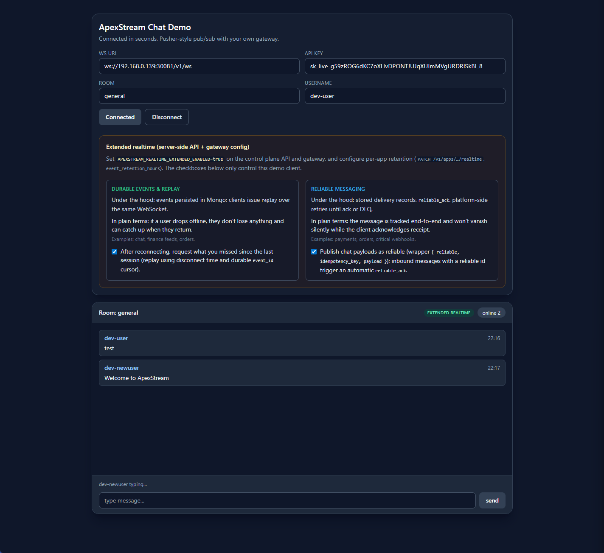

# ApexStream Demo 1 — Realtime Chat (Killer Starter)

Demo goal:

- Connect and get a working pub/sub room with minimal code
- Reasonable drop-in when you don’t want to own a bespoke WebSocket layer

See also: [Examples index](../README.md).

## Screenshot



## Architecture

```
React UI
  -> apexstream JS SDK
  -> WebSocket GET /v1/ws (+ api_key)
  -> Gateway
```

## Project structure

Copy-friendly layout — **ApexStream integration** lives mainly in **`useChat.ts`** (and small **`chatPrefs.ts`** for toggles); **`App.tsx`** only wires form state and UI.

```
examples/chat/
  client/
    src/App.tsx                 # form state → useChat
    src/useChat.ts              # ApexStream client, channel, presence, replay/reliable
    src/chatPrefs.ts            # localStorage keys for feature toggles
    src/ConnectForm.tsx
    src/ChatRoomPanel.tsx
    src/ExtendedRealtimeSection.tsx
  server/          # optional notes / placeholder
  docker-compose.yml
  README.md
```

## UX implemented

- Realtime messages on a shared channel (`chat:<room>`)
- Online-style presence / counter (from gateway snapshots where available)
- Optional durable replay & reliable messaging toggles (extended realtime)
- Dark dev theme (`#0f172a` / `#1e293b` / accent blue)

## Run locally

Paths below assume you are in **`examples/chat`** (the folder that contains `client/`).

1. **Start ApexStream** — API + gateway reachable from your machine (Compose, Kubernetes, or your team’s process).

2. **Configure the chat client**

   ```bash
   cd client
   npm install
   cp .env.example .env.local
   ```

   Edit `.env.local`:

   - **`VITE_APEXSTREAM_WS_URL`** — gateway WebSocket base URL (must end with `/v1/ws`).
   - **`VITE_APEXSTREAM_API_KEY`** — key from ApexStream dashboard (publishable `pk_live_…` or secret for local dev).

   Optional:

   - **`VITE_CHAT_ROOM`** — room name (default `general`). Channel becomes `chat:<room>`.
   - **`VITE_CHAT_USER`** — default display name.

   For **`ws://`** to a **non-localhost** host (LAN IP, Docker host, NodePort), the demo enables insecure transport when the URL uses `ws://` so the SDK accepts it (still prefer **`wss://`** in production).

3. **Run**

   ```bash
   npm run dev
   ```

4. Open **http://localhost:5173**.

Open two browser tabs with different **`VITE_CHAT_USER`** (or change names in the UI) to see messages cross-tab.

## Run with Docker Compose (optional)

From **`examples/chat`**, Compose mounts **`./client`** only (works with a copied **`chat`** tree). Compose reads **`client/.env`** (not `.env.local`). Uses **`npm ci`** — keep **`package-lock.json`** alongside **`package.json`** in **`client/`**.

```bash
cp client/.env.example client/.env
# edit client/.env — same variables as above
cd examples/chat
docker compose up
```

UI: **http://localhost:5173**.

## Wire summary

- Subscribe / publish JSON on channel `chat:<room>`
- Raw frames may include presence / replay metadata depending on gateway features

## Manual checks

1. Two tabs, different users, same room.
2. Messages appear in both tabs with low latency.
3. Toggle durable replay / reliable messaging if extended realtime is enabled server-side.

## CTA

- Ship a room-based realtime feature without maintaining your own WS cluster.
