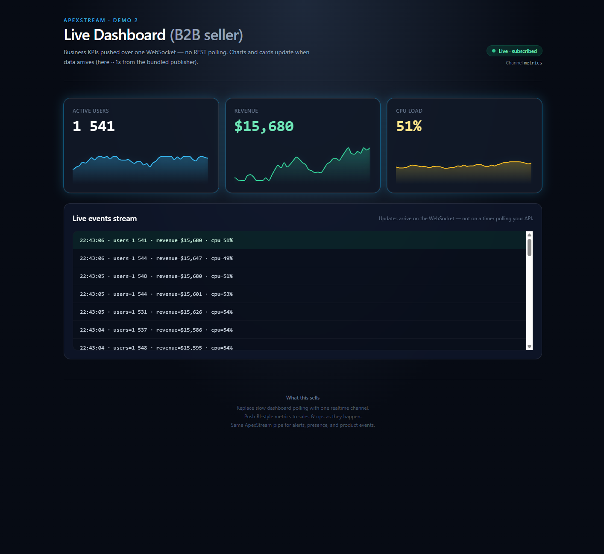

# DEMO 2 — Live Dashboard (B2B seller)

Shows **business value**: KPI cards + sparkline charts + a live event stream fed **only** over ApexStream WebSockets — **no HTTP polling** for metrics.

## Screenshot



## UX

| Active users | Revenue | CPU |
|--------------|---------|-----|
| Large KPI + area sparkline | Same | Same |

Below: **Live events stream** (recent payloads as lines). With the bundled publisher, updates default to about **3 per second** (`APEXSTREAM_PUBLISH_INTERVAL_MS`, default **300** ms); set **150–250** for an even snappier demo.

The publisher does **not** redraw random extremes every tick — it uses a **small random walk** (narrow bands, gentle steps) so KPIs drift like a real live feed. Adjust ranges in `publisher/publish.mjs` if you want tighter or wider motion.

## Architecture

```
fake backend (Node publisher)
        │ publish(channel, JSON)
        ▼
   ApexStream gateway
        │ WebSocket `message`
        ▼
   React dashboard (subscribe)
```

## Layout

**Client:** realtime metrics logic is in **`client/src/useLiveMetricsDashboard.ts`** (+ **`metricsModel.ts`**); UI tables/charts in **`DashboardLiveView.tsx`**; **`App.tsx`** is a thin shell.

```
examples/dashboard/
  client/
    src/App.tsx
    src/useLiveMetricsDashboard.ts   # subscribe + KPI/event state
    src/metricsModel.ts
    src/DashboardLiveView.tsx
  publisher/      # Node script using apexstream JS SDK (publish.mjs)
  docker-compose.yml
```

## Prerequisites

- Running ApexStream **gateway** reachable from the browser and from the publisher (same API key / app).
- A **publishable API key** (Dashboard → Issue API key).
- **Node 18+** and npm.

`client` and `publisher` depend on the **`apexstream`** package on npm (`^1.0.5`). Run **`npm install`** inside each folder; the SDK is fetched from the registry.

## Configure

From **`examples/dashboard`** (the folder that contains `client/` and `publisher/`):

```bash
cp client/.env.example client/.env
cp publisher/.env.example publisher/.env
```

Edit both files:

- **`APEXSTREAM_WS_URL`** / **`VITE_APEXSTREAM_WS_URL`** — WebSocket base URL, e.g. `ws://localhost:8081/v1/ws`.
- **`APEXSTREAM_API_KEY`** — same key in client and publisher.
- Optional: **`APEXSTREAM_METRICS_CHANNEL`** / **`VITE_APEXSTREAM_METRICS_CHANNEL`** — default `metrics`.
- If you use `ws://` to a **non-localhost** host (LAN / NodePort), the client sets **`allowInsecureTransport`** when **`wsUrl.startsWith("ws://")`** or **`VITE_APEXSTREAM_ALLOW_INSECURE=1`** (see `client/.env.example`). The Node publisher uses **`url.startsWith("ws://")`** or **`APEXSTREAM_ALLOW_INSECURE_TRANSPORT=1`**.

## Run locally (npm)

Use two terminals. Install dependencies **in each package** (`apexstream` comes from npm).

**Terminal 1 — UI**

```bash
cd examples/dashboard/client
cp .env.example .env   # if not already
npm install
npm run dev
```

**Terminal 2 — publisher**

```bash
cd examples/dashboard/publisher
cp .env.example .env   # if not already
npm install
npm start
```

Open **http://localhost:5174**.

If you copied the demo to another path, run the same commands from your folder that contains `client/` and `publisher/` (adjust the `cd` accordingly).

## Run with Docker Compose (optional)

Mounts **`./client`** and **`./publisher`** separately; **`npm ci`** in each (publisher uses **`npm install`** if no lockfile). Otherwise use **Run locally (npm)** above.

Create `client/.env` and `publisher/.env` first (compose uses `env_file`).

```bash
cd examples/dashboard
docker compose up
```

UI: **http://localhost:5174**. If the gateway runs on your machine (not inside Compose), use `ws://host.docker.internal:8081/v1/ws` in both env files and enable the insecure-transport flags from `.env.example` when using plain `ws://`.

## Pitch

- **Stop polling** dashboards — push KPI deltas on one channel.
- **Realtime BI** for revenue and ops narratives (this demo uses **simulated drift**, not wild random jumps; plug in real totals from your stack the same way).
