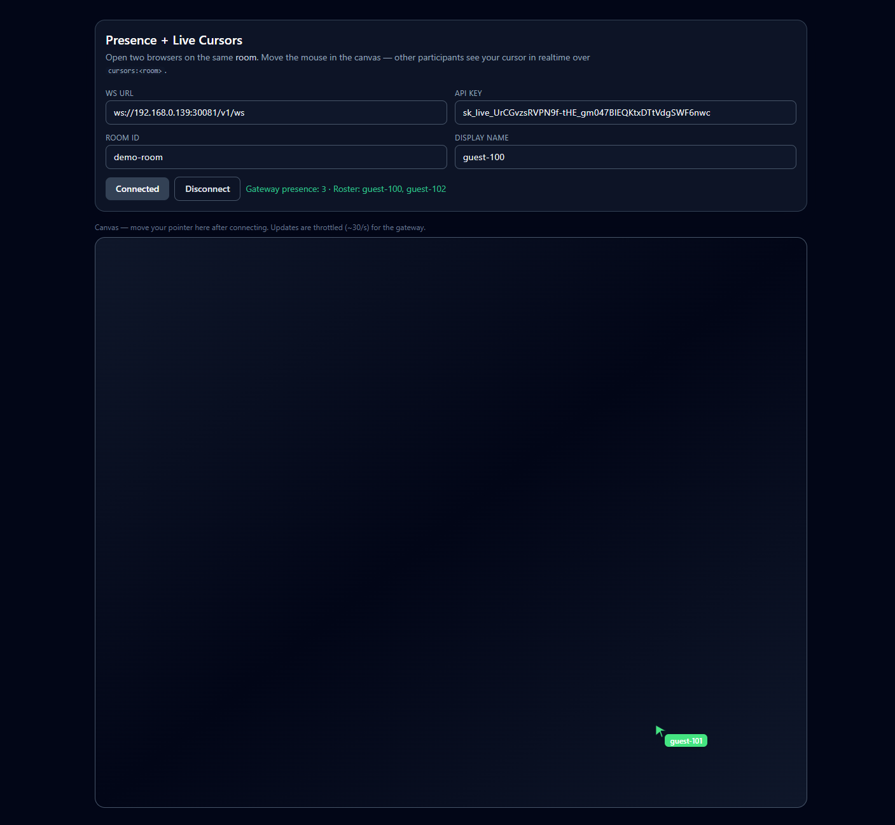

# ApexStream DEMO 4 — Presence + Live Cursors

**Runnable client:** `client/` (Vite + React, port **5176**). See [Examples index](../README.md).

## Screenshot



## Client source

**`client/src/usePresenceCursors.ts`** — WebSocket channel, presence, cursor publishes (throttled). **`PresenceCanvas.tsx`** / **`PresenceConnectForm.tsx`** — UI; **`App.tsx`** holds connection form state and passes handlers into the canvas.

---

## Why (the “wow”)

A **visual** realtime proof: open two browsers, move the mouse, and watch **everyone else’s cursors** and **who’s online** with low latency. Good for demos and screen recordings.

---

## Run (typical)

1. Start ApexStream (API + gateway) the way you usually do (Compose, bare metal, etc.).
2. In the **dashboard**: org → project → app → issue an **API key**.
3. From **`examples/presence-cursors`** (or from `client/` — same result):

   ```bash
   cd examples/presence-cursors
   cp client/.env.example client/.env
   # Edit client/.env: VITE_APEXSTREAM_WS_URL, VITE_APEXSTREAM_API_KEY, optional room / display name
   npm install --prefix client
   npm run dev
   ```

   You can also `cd client` and run `npm install` / `npm run dev` there.

4. Open **http://localhost:5176** in two windows, same room — move the mouse in the canvas.

**Docker Compose (optional):** from `examples/presence-cursors/`, copy `client/.env.example` to `client/.env`, then `docker compose up` — mounts `./client` only (see compose file comments).

---

## Technical story

| Topic | Detail |
|-------|--------|
| Transport | Same gateway WebSocket as other demos — `GET /v1/ws` with dashboard API key. |
| Channels | **`cursors:<room_id>`** — cursor payloads `{ type: "cursor.position", userKey, user, x, y, ts }` with **normalized** `x`,`y` in `[0,1]` (viewport-relative). |
| Presence | `{ type: "presence", user, state: "join"\|"leave", at }` on the **same channel** (same pattern as the chat demo). Gateway **presence_snapshot** / **presence_update** still applies to this channel. |
| Throttling | Client limits publishes to ~**30 Hz** so the gateway stays healthy. |
| Privacy / scale | Keep payloads small; tune throttle if needed. |

Replace placeholder hosts in docs with yours (e.g. LAN gateway **`192.168.1.10`**, not committed keys).

---

## Pitch (one paragraph)

Presence and live cursors turn **abstract realtime** into something **visible in seconds** — collaboration and SaaS positioning without bespoke WebSocket infrastructure.
