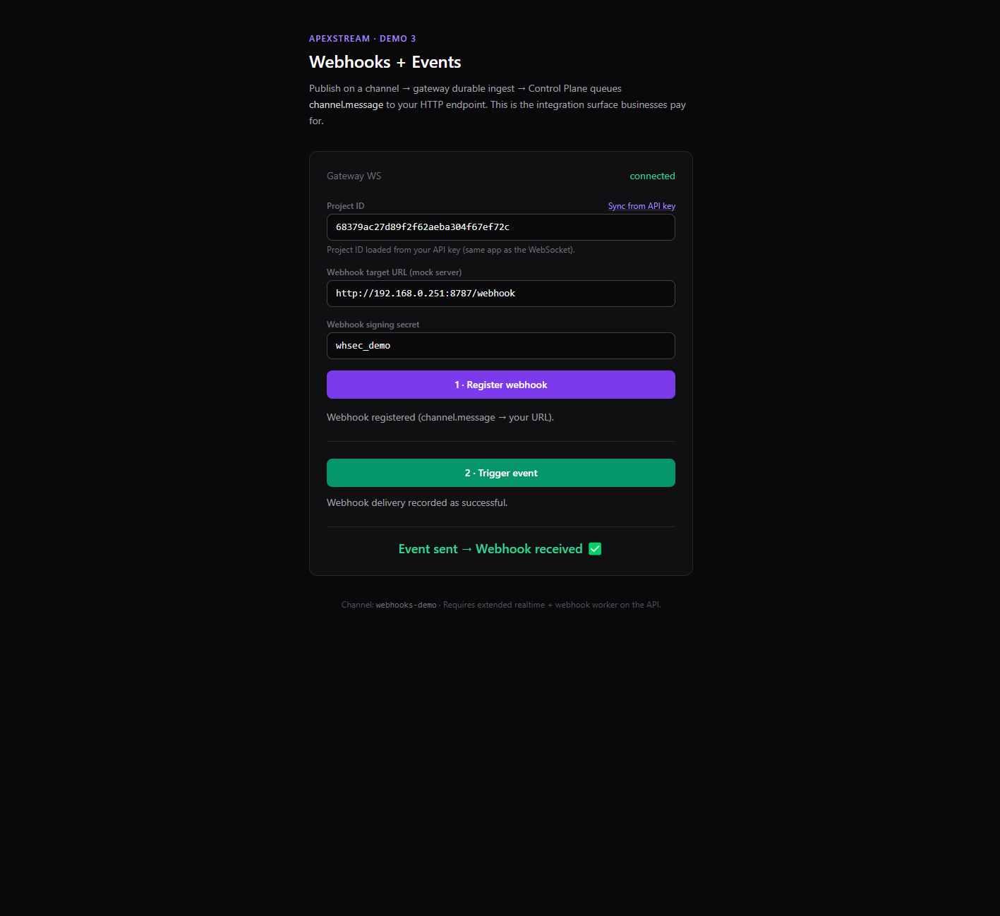

# DEMO 3 — Webhooks + Events

This example lives under **`examples/webhooks/`** next to [Chat](../chat/README.md) and [Live Dashboard](../dashboard/README.md); the index is [examples/README.md](../README.md).

**Goal:** show **integrations**: your product publishes realtime events → ApexStream calls the customer’s **HTTP(S) endpoint** (webhook) with **signed** JSON — the kind of **integration / enterprise** story that is easy to price.

**What it is not:** a second “chat” or “metrics” demo. It answers: *“When something happens in our realtime system, can you **call our backend** (or the end customer’s) with a verifiable payload?”* **Yes** — via `channel.message` webhooks after durable ingest (extended realtime path).

## Screenshot



## UX

1. **[1 · Register webhook]** — stores your mock URL + secret on the project (`POST /external/v1/webhooks`, event `channel.message`).
2. **[2 · Trigger event]** — publishes JSON on WebSocket channel `webhooks-demo`.
3. Line **Event sent → Webhook received ✅** appears when the Control Plane records a **successful** delivery (and the mock server logged a POST).

## Architecture

```
Browser (this demo app)
   │ publish(ws) on webhooks-demo
   ▼
 Gateway → internal durable ingest (extended realtime ON)
   ▼
 Control Plane → webhook worker → POST customer URL
   ▼
 mock-server (this example) — logs body to terminal
```

## Prerequisites

| Requirement | Why |
|-------------|-----|
| **Extended realtime** enabled on **API + gateway** | Gateway calls `POST /internal/v1/durable/ingest`; ingest enqueues **`channel.message`** webhooks. |
| **`APEXSTREAM_EXTERNAL_API_KEY`** set on the API | External API routes (`/external/v1/*`) stay disabled otherwise. Same value → `VITE_EXTERNAL_API_KEY` in this demo client. |
| **Webhook worker** running | Default API starts it (`StartWebhookWorker`). |
| **Project ID** | From ApexStream dashboard (same project whose app owns your publish API key). |

If the API runs **inside Docker** and the mock server on the host, register webhook URL **`http://host.docker.internal:8787/webhook`** (or your LAN IP), not plain `127.0.0.1`.

## Layout

**Integration surface:** **`client/src/externalApi.ts`** (dev proxy path + `fetch` to External API) and **`client/src/WebhooksWorkflow.tsx`** (register webhook → publish → delivery pipeline). **`App.tsx`** is layout + title only.

```
examples/webhooks/
  README.md
  docker-compose.yml       # optional: UI + mock (see below)
  mock-server/server.mjs   # node-only HTTP receiver + logs
  client/
    src/externalApi.ts
    src/WebhooksWorkflow.tsx
    src/App.tsx
```

## Configure

From **`examples/webhooks`**:

```bash
cp client/.env.example client/.env
```

Fill **`VITE_APEXSTREAM_*`** with gateway URL + **publishable** API key. Set **`VITE_EXTERNAL_API_KEY`** equal to **`APEXSTREAM_EXTERNAL_API_KEY`** from your API `.env`.

### Stack on a LAN IP (example hostnames — replace with yours)

Suppose the gateway/API VM is **`192.168.1.10`** and your laptop running the mock is **`192.168.1.100`**:

1. **`VITE_APEXSTREAM_WS_URL=ws://192.168.1.10:30081/v1/ws`** (gateway WebSocket URL on your network). The client sets **`allowInsecureTransport`** when the URL is **`ws://`** and/or **`VITE_APEXSTREAM_ALLOW_INSECURE=1`** (local HTTP page — see `client/.env.example`).
2. **`VITE_CONTROL_PLANE_URL=http://192.168.1.10:8080`** (or whatever port serves the **Control Plane HTTP** API on that host — must be the same service that handles `GET/POST /external/v1/...`). The Vite dev server proxies `/apex-api` to this URL so the browser does not need CORS on the API.
3. **Webhook URL in the form** must be **reachable from the API process** (not from your browser). If the mock server runs on another machine, use its LAN IP, e.g. `http://192.168.1.100:8787/webhook`, not `127.0.0.1` (from the API, loopback is the API host). If the API runs in Docker, use `http://host.docker.internal:8787/...` or the host’s IP.

Optional: **`VITE_PROJECT_ID`**, **`VITE_WEBHOOK_TARGET_URL`**, **`VITE_WEBHOOK_SECRET`** defaults.

Dev mode uses **Vite proxy** (`/apex-api` → `http://localhost:8080`) so the browser does not hit CORS on the External API.

## Run

**Terminal 1 — mock receiver**

```bash
cd examples/webhooks/mock-server
node server.mjs
```

**Terminal 2 — UI**

```bash
cd examples/webhooks/client
npm install
npm run dev
```

Open **http://localhost:5175**.

If your working directory is already **`examples/webhooks`**, use `cd client` instead of the full path.

Then:

1. Paste **project id**, confirm webhook URL matches the mock server (host/port reachable from API).
2. **Register webhook**, then **Trigger event**.
3. Watch the mock terminal for **`X-Apexstream-Event: channel.message`** and JSON body.

## Run with Docker Compose (optional)

Mounts **`./client`** and **`./mock-server`** (`npm ci` / **`npm install`** respectively). Starts **Vite** (`5175`) and the **mock receiver** (`8787`). If the Control Plane runs on your host and the UI is in Docker, add **`VITE_CONTROL_PLANE_PROXY_TARGET=http://host.docker.internal:8080`** to **`client/.env`** so the **`/apex-api`** dev proxy can reach it.

```bash
cp client/.env.example client/.env
# edit client/.env
cd examples/webhooks
docker compose up
```

- UI: **http://localhost:5175**
- Mock listens on **http://localhost:8787** (published from the container). Register the webhook as **`http://host.docker.internal:8787/webhook`** if Control Plane runs where that hostname resolves (e.g. Docker Desktop), or use your machine’s **LAN IP** so the API can reach port **8787**. Then follow the same **Try it** steps as above.

## Pitch

- **Sell integrations** — CRM, billing, Slack, internal ETL — all driven off one realtime pipe + signed webhooks.
- **No polling** the customer stack for “what happened”; you **push** outcomes when events happen.
